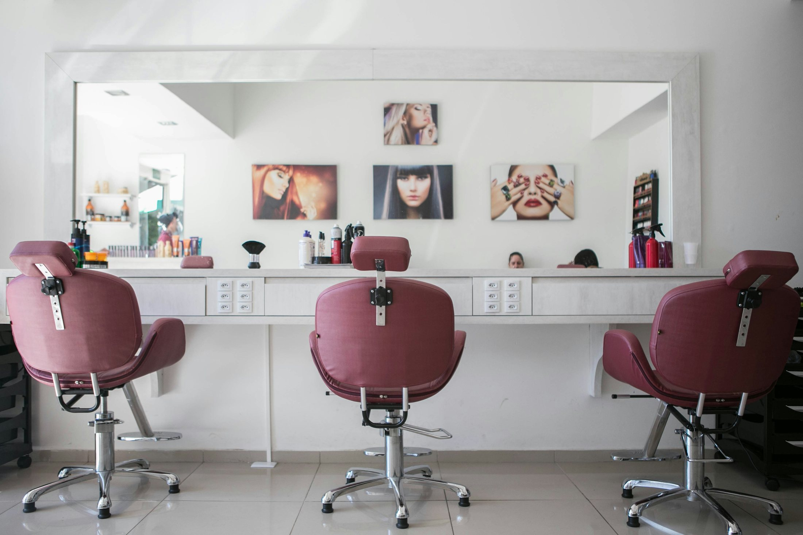

<div align="center">

# FÁNCY — Beauty House

**A premium digital experience for a modern beauty house in Rivne, Ukraine.**

<p>
  <a href="https://fancy-8ziv6qsjw-ke1fosaos-projects.vercel.app">
    
  </a>
  <a href="https://nextjs.org/">
    
  </a>
  <a href="https://www.typescriptlang.org/">
    
  </a>
</p>

<p><em>Краса, що звучить як ти.</em></p>

</div>

<a href="https://fancy-8ziv6qsjw-ke1fosaos-projects.vercel.app">
  
</a>

<div align="center">
  <strong>
    <a href="https://fancy-8ziv6qsjw-ke1fosaos-projects.vercel.app">Explore the live website ↗</a>
  </strong>
</div>

## About the project

FÁNCY is a responsive, Ukrainian-language website created for a beauty house in Rivne. It combines an editorial visual style with a practical customer journey: visitors can discover services, compare prices, browse the gallery, find the salon, and submit an appointment request without leaving the website.

The experience is designed around FÁNCY’s full range of services — hair, nails, makeup, brows, lashes, colouring, styling, and professional hair care.

## Highlights

- premium responsive interface for desktop, tablet, and mobile
- complete service catalogue with structured prices and direct section links
- online booking flow with service, date, time, contact details, and comments
- server-side validation powered by Zod
- honeypot spam protection and request rate limiting
- booking delivery through Telegram or a custom webhook
- gallery, about, contacts, privacy, and dedicated booking pages
- scroll reveals, micro-interactions, marquee, FAQ, and animated UI details
- Google Maps, phone, and Instagram contact actions
- metadata, Open Graph, Twitter cards, sitemap, robots, manifest, and structured data
- security-focused HTTP headers and production-ready Vercel configuration

## Tech stack

| Technology | Purpose |
| --- | --- |
| **Next.js 16** | App Router, server rendering, API routes, metadata |
| **React 19** | Component-based interface |
| **TypeScript 5.8** | Static typing and safer development |
| **Motion** | Reveals and interface animation |
| **Lucide React** | Consistent iconography |
| **Zod** | Booking form validation |
| **Vercel** | Production deployment |

## Main routes

| Route | Description |
| --- | --- |
| `/` | Homepage and primary customer journey |
| `/services` | Full service catalogue and prices |
| `/gallery` | Beauty work gallery |
| `/about` | FÁNCY story and values |
| `/contacts` | Address, schedule, map, and contacts |
| `/booking` | Dedicated appointment request page |
| `/privacy` | Privacy information |
| `/api/booking` | Validated booking request endpoint |

## Getting started

### Requirements

- Node.js `22.x`
- npm

### Installation

```bash
git clone https://github.com/Ke1fosao/FANCY.git
cd FANCY
npm install
npm run dev
```

Open [http://localhost:3000](http://localhost:3000) in your browser.

## Environment variables

Create `.env.local` in the project root when booking delivery or production SEO URLs are needed:

```env
NEXT_PUBLIC_SITE_URL=https://your-domain.com
TELEGRAM_BOT_TOKEN=your_bot_token
TELEGRAM_CHAT_ID=your_chat_id
BOOKING_WEBHOOK_URL=https://your-webhook.example.com
```

`TELEGRAM_BOT_TOKEN`, `TELEGRAM_CHAT_ID`, and `BOOKING_WEBHOOK_URL` are optional delivery channels. Never commit real secrets to the repository.

## Quality checks

Run all checks before deployment:

```bash
npm run typecheck
npm run lint
npm run build
```

## Project structure

```text
FANCY/
├── public/
│   ├── images/          # Local visual assets
│   └── downloads/       # Downloadable price list
├── src/
│   ├── app/             # Routes, metadata, and booking API
│   ├── components/      # Reusable interface components
│   └── data/            # Site content, gallery, and services
├── docs/                # Project notes and credits
├── next.config.ts       # Next.js and security configuration
└── package.json
```

## Content management

The main content can be updated without restructuring the application:

- salon details, schedule, contacts, and navigation: `src/data/site.ts`
- services and prices: `src/data/services.ts`
- gallery collection: `src/data/gallery.ts`
- homepage composition: `src/app/page.tsx`
- global visual system: `src/app/globals.css`

## Deployment

The project is configured for Vercel:

1. Import the GitHub repository into Vercel.
2. Add the required environment variables.
3. Deploy the `main` branch.
4. Set `NEXT_PUBLIC_SITE_URL` to the final production URL.

Current deployment: **[fancy-8ziv6qsjw-ke1fosaos-projects.vercel.app](https://fancy-8ziv6qsjw-ke1fosaos-projects.vercel.app)**

## Author

Designed and developed by **[Ke1fosao](https://github.com/Ke1fosao)**.

- Email: [dima.kovtunovych@gmail.com](mailto:dima.kovtunovych@gmail.com)
- Repository: [Ke1fosao/FANCY](https://github.com/Ke1fosao/FANCY)

---

<div align="center">
  <sub>Built with attention to detail for FÁNCY — дім краси.</sub>
</div>
